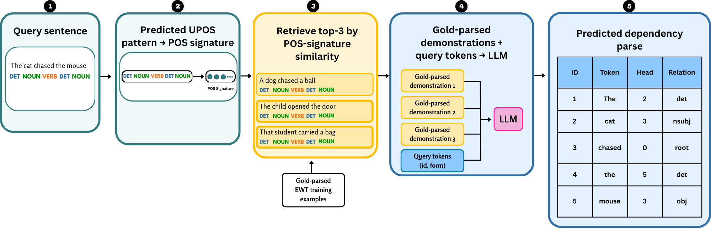

# POS-Signature Demonstration Retrieval for In-Context Dependency Parsing

**Muhammad Azam Afridi · Rajab Ali · Marco Passarotti**

Research implementation and reproducibility artifact accompanying the paper
*POS-Signature Demonstration Retrieval for In-Context Dependency Parsing*.
This repository includes retrieval and evaluation code, the original prompts,
final model responses, and scripts that regenerate the paper's LLM results.
The LaTeX manuscript is maintained separately; a public paper link and identifier
will be added when available. Citation metadata is in [CITATION.cff](CITATION.cff).

## Study overview

The paper asks whether demonstrations selected for syntactic relevance help
LLMs perform Universal Dependencies parsing more effectively than fixed or
semantically similar examples. The proposed policy represents sentences with
POS statistics and retrieves three gold-parsed examples from the labeled
training split. Model parameters remain frozen.

| Item | Setting |
|---|---|
| Task | Predict a head and dependency relation for each gold-tokenized query word |
| Dataset | UD English Web Treebank v2.17 |
| Splits | 12,544 training sentences, 2,001 development sentences (unused), 2,077 test sentences |
| Models | `openai/gpt-oss-120b` and `Qwen/Qwen2.5-72B-Instruct`, served through DeepInfra |
| Evaluation | Token-weighted UAS/LAS over 21,998 gold non-punctuation test tokens; LAS is primary |
| Statistics | 10,000 paired sentence-bootstrap resamples, seed 42; Holm correction for four primary retrieval contrasts |

The six prompting conditions are:

| Condition | Demonstrations or intervention |
|---|---|
| Zero-Shot | Task instruction without demonstrations |
| Fixed Few-Shot | The same three manually selected training examples for every query |
| POS-Signature Few-Shot | Three examples selected by POS-signature similarity and length compatibility |
| Semantic Few-Shot | Three examples selected by `all-mpnet-base-v2` sentence-embedding similarity |
| Chain-of-Thought | One fixed worked example, with reasoning before the final parse |
| Critique-Refine | A second model call reviewing the extracted Chain-of-Thought parse |

### POS-signature retrieval



Stanza predicts query UPOS tags; training signatures use gold UPOS. A
306-dimensional signature combines length/composition features, POS unigram
and bigram frequencies, and selected category ratios. Fixed block weights
`0.2 / 0.3 / 0.4 / 0.1` precede one global L2 normalization.

Candidates are filtered by length, falling back to the full pool if the window
is empty, then ranked by cosine similarity. Exact query-text matches and
duplicate selected texts are skipped. The first three remaining examples supply
gold token records in the prompt. Predicted query POS tags guide retrieval but
are not shown to the LLM; the diagram's sentences are illustrative.

The three few-shot policies share a three-example budget and demonstration
format. POS and Semantic compare complete selection policies, including their
different candidate filters. CoT and Critique-Refine are broader system
comparisons. Findings are exploratory and scoped to these two models, one
English treebank, gold query tokenization, and labeled in-domain demonstrations.

## Main results

UAS and LAS are percentages. Missing or unscorable predictions receive zero
credit without reducing the common denominator.

| Condition | gpt-oss UAS | gpt-oss LAS | Qwen UAS | Qwen LAS |
|---|---:|---:|---:|---:|
| Zero-Shot | 75.1 | 64.7 | 75.7 | 62.9 |
| Fixed Few-Shot | 76.5 | 67.3 | 76.3 | 65.3 |
| **POS-Signature Few-Shot** | **80.4** | **72.4** | **82.1** | **73.2** |
| Semantic Few-Shot | 79.6 | 70.5 | 80.8 | 70.5 |
| Chain-of-Thought | 78.6 | 70.0 | 72.4 | 61.7 |
| Critique-Refine | 79.1 | 70.4 | 74.6 | 63.6 |

POS-Signature has the highest LAS among the tested prompting systems, exceeding
Semantic by **1.9 points for gpt-oss** and **2.7 points for Qwen**. See
[full-precision results](results/paper_results.json),
[readable tables](results/generated_tables.md), and the
[scoring and statistics protocol](docs/protocol.md).

## Quick start

Install [uv](https://docs.astral.sh/uv/getting-started/installation/) 0.12.5 or
newer. The Make workflow requires Make and Bash. Run from the repository root:

```sh
make setup       # Install the locked reproduction environment
make verify      # Verify delivered archives, checksums, and results
make reproduce   # Regenerate results, tables, figures, and prompt provenance
make test        # Install the locked development group and run tests
```

`.python-version` selects Python **3.12.14**. The default environment contains
only NumPy **2.3.5** and Pillow **12.3.0**; `pyproject.toml` defines dependencies
and `uv.lock` records their resolved versions. The three requirements files are
generated exports for pip users. Every Make target uses `--locked`.

Initial setup may download Python and packages. Once dependencies are installed,
verification and reproduction require no API credentials or network access:

```sh
UV_OFFLINE=1 make reproduce
```

All **24 compressed archives** and **24,921 response records** are included.
Scripts read `.json.gz` files directly; no manual extraction is needed.
Reproduction checks numerical reference hashes and reconstructs the archived
prompt pairs. Generated figure bytes can vary with fonts and PDF metadata;
after regeneration, check numerical agreement with:

```sh
uv run --locked --no-dev python scripts/verify.py --results-only
```

See [reproduction and maintenance](docs/reproduction.md) for direct uv commands,
pip installation, dependency updates, and checksum maintenance. The current
[validation record](docs/validation.md) reports 119 passing tests.

## Project structure

```text
.
├── README.md                 Paper overview and getting started
├── CITATION.cff              Citation metadata
├── LICENSE.md                Project licensing status
├── Makefile                  Setup, verification, reproduction, and tests
├── pyproject.toml            Dependency definitions and optional groups
├── uv.lock                   Resolved dependency versions and package hashes
├── .python-version           Tested Python version
├── requirements*.txt         Generated pip compatibility exports
├── src/                      Research implementation and analysis
├── scripts/                  Workflow entry points and maintenance utilities
├── tests/                    Evaluator, analysis, and publication-utility tests
├── prompts/                  Six original prompt source files
├── data/UD_English-EWT/       Train/dev/test CoNLL-U files and upstream notices
├── outputs/<model>/<condition>/
│   ├── model_responses.json.gz   Exact prompts, raw outputs, and recorded metadata
│   └── model_evaluation.json.gz  Extracted parses and evaluation records
├── results/                  Full-precision scores, diagnostics, and tables
├── figures/                  Method schematic and relation/length figures
├── docs/                     Protocol, prompt provenance, and workflow guides
└── checksums/                Input and complete-delivery SHA-256 manifests
```

### Code entry points

| File | Responsibility |
|---|---|
| [src/syntactic_similarity.py](src/syntactic_similarity.py) | POS signatures, length filtering, cosine retrieval, and demonstration serialization |
| [src/semantic_similarity.py](src/semantic_similarity.py) | Sentence-embedding retrieval over the training pool |
| [src/collect_responses.py](src/collect_responses.py) | First-pass model calls and raw response recording |
| [src/collect_critique_responses.py](src/collect_critique_responses.py) | Second-pass critique of extracted CoT parses |
| [src/evaluate_responses.py](src/evaluate_responses.py) | Response extraction, schema validation, and token-level evaluation |
| [src/reproduce_paper_results.py](src/reproduce_paper_results.py) | Authoritative fixed-denominator scoring, bootstrap comparisons, and diagnostics |
| [src/generate_prompt_provenance.py](src/generate_prompt_provenance.py) | Reconstruct and verify archived prompts; generate the source snapshot and manifest |
| [src/export_tables.py](src/export_tables.py) | Export results as CSV and LaTeX tables |
| [src/generate_final_relation_diagnostics.py](src/generate_final_relation_diagnostics.py) | Render relation and sentence-length figures |
| [scripts/reproduce.sh](scripts/reproduce.sh) | Run the complete offline reproduction workflow |
| [scripts/verify.py](scripts/verify.py) | Check archive integrity, gold alignment, and numerical references |

`src/analyze_results.py` and `src/extended_error_analysis.py` retain additional
per-model diagnostics and their tests. Their conditional summaries can use
different subsets; use `make reproduce` for the paper's reported results.
`scripts/init_tracker.py` prepares new-run trackers, while
`scripts/update_checksums.py` refreshes delivery manifests after reviewed changes.

## Optional new inference

New model collection is separate from offline reproduction. It requires a
DeepInfra API key, downloads model-library dependencies, and incurs API usage.
Install the optional environment with:

```sh
uv sync --locked --no-dev --extra inference
```

Follow [the inference guide](docs/inference.md) for tracker initialization,
condition-specific commands, and evaluation. New-run defaults use Git-ignored
`runs/` paths. Historical provider revisions and exact Stanza resources were
not preserved, so new inference need not reproduce the archived responses.
The supplied Stanza reference runner is optional and is not run by Make targets.

## Citation and licensing

The author list and paper title above match the current manuscript.
[CITATION.cff](CITATION.cff) provides citation metadata; the public paper
identifier will be added when available.

A project-level reuse license has **not yet been selected**; see
[LICENSE.md](LICENSE.md). The bundled English-EWT data retains its
[upstream license](data/UD_English-EWT/LICENSE.txt) and
[source notices](data/UD_English-EWT/README.md).
